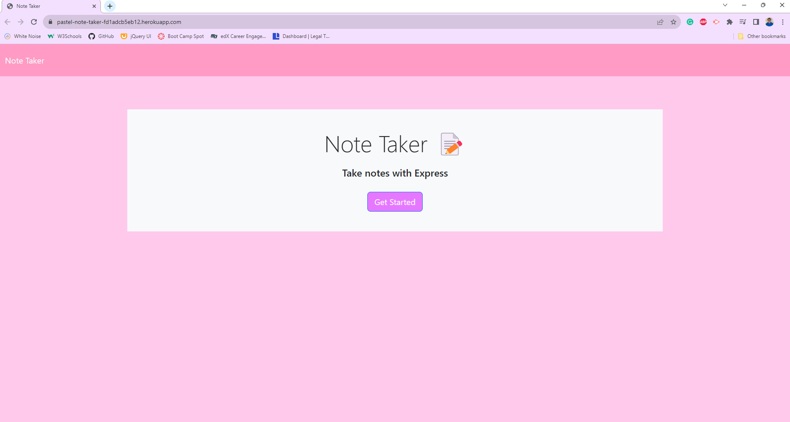

  
  # Pastel Note Taker

  ## Table of Contents
  * [Description](#description)
  * [Installation](#installation)
  * [Usage](#usage)
  * [Tests](#tests)
  * [Contributors](#contributors)
  * [Questions](#questions)
  * [License](#license)

  ## Description
  A very pink note taking application, where the user can add, save and delete notes.

  

  ## Installation
  To view the application in your own browser, please click the following [link](https://pastel-note-taker-fd1adcb5eb12.herokuapp.com/)

  ## Usage
  To use the application, simply click the link provided, then click the 'Get Started' button. After which, you are free to add and delete as many notes as you'd like.

  ## Tests
  N/A

  ## Contributors
  Ollie Terry, Kayvon Kazemini

  ## Questions
  If you have any questions, please don't hesitate to reach me via email at oliverwills0227@gmail.com

  ## License 
    This project is licensed with MIT